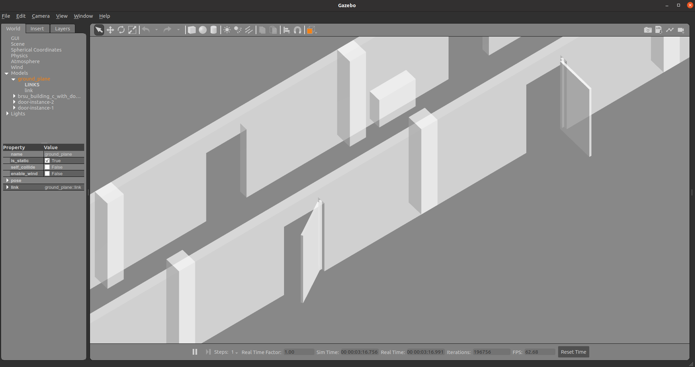

# scenery_builder

## Installation

```shell
pip install -e .
```

## Usage

This module adds `floorplan` as a command line interface. You can use the `generate` command as shown below:

```shell
floorplan generate <path to config file> <path to input folder>
```

Where the input folder must contain:
- the composable models generated from the [FloorPlan DSL](https://github.com/secorolab/FloorPlan-DSL)
    - `coordinate.json`
    - `floorplan.json`
    - `shape.json`
    - `skeleton.json`
    - `spatial_relations.json`
- the door object models
    - `object-door.json`
    - `object-door-states.json`
- any object instance models, e.g. `object-door-instance-X.json` where `X` is a unique numeric ID.

## Task generator

It uses the FloorPlan insets to generate a task specification.
The inset width -- a float value representing the distance between the sides of the inset and original shapes -- can be configured in the [config](config/config.toml)

## Object placing

This tool places objects in indoor environments. 
By using the composable modelling approach, a scenery can compose the static FloorPlan models with objects such as doors.



### Models that can be composed into a scenery

* **Model objects with movement constraits**: composition of objects with revolute, prismatic, or fixed joints into a scenery. 
* **Model object states**: composition of objects with motion constraints defined as finite state machines, and their intial state in the scene.

## Gazebo world generation

The tool generates SDF format world files for Gazebo.
The [initial state plugin](https://github.com/secorolab/floorplan-gazebo-plugins) sets up the scene as determined by the initial state for each object included in the world file. 

## Tutorials

Tutorials on how to model objects with movement constraints, and how to place them in floor plan models is available [here](docs/tutorial.md).

# Acknowledgement

This work is part of a project that has received funding from the European Union's Horizon 2020 research and innovation programme SESAME under grant agreement No 101017258.

<p align="center">
    
    
</p>