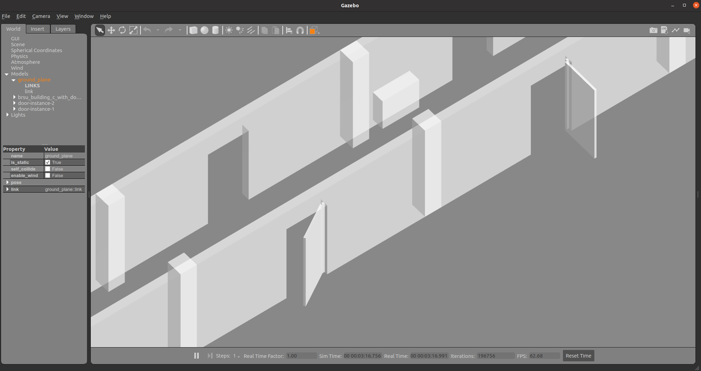

# scenery_builder

## Installation

Install all the requirements:

```shell
sudo apt-get install blender python3-pip python3-venv -y
```

First, create a virtual environment and activate it: 

```shell
python -m venv .venv
source .venv/bin/activate
```

For Blender to regonize the virtual environment, add it to your `PYTHONPATH`:

```shell
export PYTHONPATH=<Path to .venv directory>/lib/python3.11/site-packages   
```

From the root directory of the repo, install the python packages by running: 

```shell
pip install -e .
```

## Usage

This module adds `floorplan` as a command line interface. You can use the `generate` command as shown below:

```shell
floorplan generate <path to config file> -i <path to input folder>
```

Where the input folder must contain:
- the composable models generated from the [FloorPlan DSL](https://github.com/secorolab/FloorPlan-DSL)
    - `coordinate.json`
    - `floorplan.json`
    - `shape.json`
    - `skeleton.json`
    - `spatial_relations.json`
- the door object models
    - `object-door.json`
    - `object-door-states.json`
- any object instance models, e.g. `object-door-instance-X.json` where `X` is a unique numeric ID.

### Generating 3D meshes and occupancy grid maps

> [!WARNING]
> The generation of 3D meshes and occupancy grid maps is currently being moved from the [FloorPlan DSL](https://github.com/secorolab/FloorPlan-DSL) repository. The instructions below may not work and/or may be outdated.

This tool is currently in active development. To use the tool you can execute the following command: 

```sh
blender --python src/floorplan_dsl/generators/floorplan.py --background
--python-use-system-env -- <path to model>
```

Optionally, you can remove the `--background` flag to see directly the result opened in Blender.

***Note**: The `--` before `<model_path>` is intentional and important.*

#### Example


An example model for a building is available [here](../models/examples/hospital.floorplan). To generate the 3D mesh and occupancy grid:


```sh
blender --background --python src/exsce_floorplan/exsce_floorplan.py --python-use-system-env -- models/examples/hospital.floorplan
```

The `--` after the variable paths are important to distinguish the blender parameters and the parameters for the tooling. You will obtain an occupancy grid map and a `.stl` file with the 3D mesh of the environment.

That should generate the following files:

```bash
.
├── map
│   ├── hospital.pgm
│   └── hospital.yaml
└── mesh
    └── hospital.stl
```

The output path for the generated models in configurable (see [confg/setup.cfg](../config/setup.cfg) and note they are relative paths from where you're calling the command).

The `.stl` mesh can now be used to specify the Gazebo models and included in a Gazebo world. See, for example, [this tutorial](https://classic.gazebosim.org/tutorials?tut=import_mesh&cat=build_robot).


## Task generator

It uses the FloorPlan insets to generate a task specification.
The inset width -- a float value representing the distance between the sides of the inset and original shapes -- can be configured in the [config](config/config.toml)

## Object placing

This tool places objects in indoor environments. 
By using the composable modelling approach, a scenery can compose the static FloorPlan models with objects such as doors.



### Models that can be composed into a scenery

* **Model objects with movement constraits**: composition of objects with revolute, prismatic, or fixed joints into a scenery. 
* **Model object states**: composition of objects with motion constraints defined as finite state machines, and their intial state in the scene.

## Gazebo world generation

The tool generates SDF format world files for Gazebo.
The [initial state plugin](https://github.com/secorolab/floorplan-gazebo-plugins) sets up the scene as determined by the initial state for each object included in the world file. 

## Tutorials

Tutorials on how to model objects with movement constraints, and how to place them in floor plan models is available [here](docs/tutorial.md).

# Acknowledgement

This work is part of a project that has received funding from the European Union's Horizon 2020 research and innovation programme SESAME under grant agreement No 101017258.

<p align="center">
    
    
</p>
