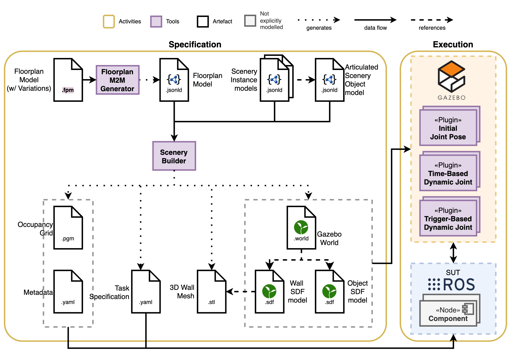
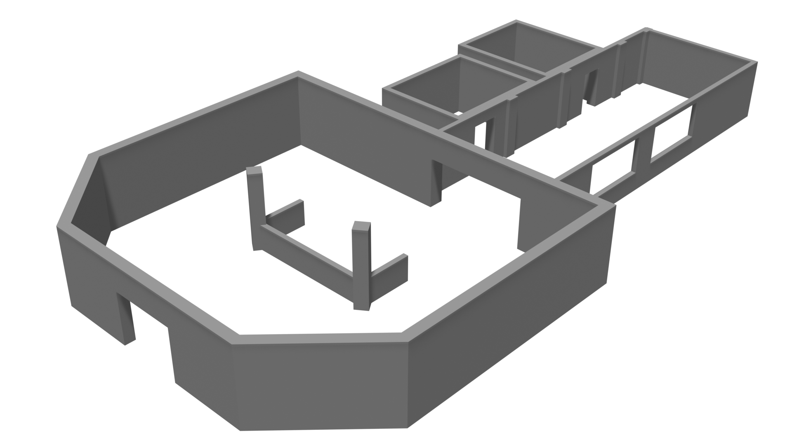

The `scenery_builder` is a tool that generates execution artefacts from the composable representation of the [FloorPlan DSL](https://secorolab.github.io/FloorPlan-DSL) models.





## Installation

Install all the requirements:

```shell
sudo apt-get install blender python3-pip python3-venv -y
```

First, create a virtual environment and activate it: 

```shell
python -m venv .venv
source .venv/bin/activate
```

For Blender to regonize the virtual environment, add it to your `PYTHONPATH`:

```shell
export PYTHONPATH=<Path to .venv directory>/lib/python3.11/site-packages   
```

From the root directory of the repo, install the python packages by running: 

```shell
pip install -e .
```

## Usage

This module adds `floorplan` as a command line interface. You can use the `generate` command as shown below:

```shell
floorplan generate -i <path to input folder>
```

Where the input folder(s) must contain:
- the composable models generated from the [FloorPlan DSL](https://github.com/secorolab/FloorPlan-DSL)
    - `coordinate.json`
    - `floorplan.json`
    - `polyhedron.json`
    - `shape.json`
    - `skeleton.json`
    - `spatial_relations.json`
- the door object models (optional)
    - `object-door.json`
    - `object-door-states.json`
- any object instance models (optional), e.g. `object-door-instance-X.json` where `X` is a unique numeric ID.

For more information on the parameters that can be used to customize the generation simply call 

```bash
floorplan generate --help
```

The command above currently generates the following artefacts: 
- 3D mesh in `.stl` format
- Gazebo models and worlds (`.sdf`, `.config`)
- Launch files for ROS1 and/or ROS2 (`.launch`)
- Occupancy grid map for the ROS map_server (`.pgm` and `.yaml`)
- Tasks with a list of waypoints in `.yaml`
- A 3D polyline representation for the SOPRANO project (`.poly`)

### Docker

To use the scenery_builder via Docker, simply mount the input and output paths as volumes and run the container. This will run the `floorplan generate` command with the default values defined in the entrypoint.

```bash
docker run -v <local input path>:/usr/src/app/models -v <local output path>:/usr/src/app/output scenery_builder:latest
```

If you want to change the path of the volumes inside the Docker container (i.e., `/usr/src/app/models` or `/usr/src/app/output`) or want to customize the arguments, use the following:

```bash
docker run -v <local input path>:/usr/src/app/models -v <local output path>:/usr/src/app/output scenery_builder:latest -i /usr/src/app/models -o /usr/src/app/output <optional arguments>
```

## Example



An example model for a building is available [here](https://github.com/secorolab/FloorPlan-DSL/blob/devel/models/examples/hospital.fpm2). After transforming the floorplan model into its composable representation, generate the artefacts by passing the folder with the JSON-LD models as inputs:


```sh
floorplan generate -i hospital/json-ld -o hospital/gen
```

That should generate the following files:

```bash
.
├── 3d-mesh
│   └── hospital.stl
├── gazebo
│   ├── models
│   │   └── hospital
│   │       ├── model.config
│   │       └── model.sdf
│   └── worlds
│       └── hospital.sdf
├── maps
│   ├── hospital.pgm
│   └── hospital.yaml
├── polyline
│   └── hospital.poly
├── ros
│   └── launch
│       └── hospital.ros2.launch
└── tasks
    ├── hallway_task.yaml
    ├── reception_task.yaml
    ├── room_A_task.yaml
    └── room_B_task.yaml
```


## Task generator

It uses the FloorPlan corners to generate a task specification to visit all corners in a space.
The option `--dist-to-corner` is a float value representing the distance between the corner of a space and its center.

## Object placing

This tool places objects (e.g. doors) in indoor environments. 
By using the composable modelling approach, a scenery can compose the static FloorPlan models with objects such as doors.


### Models that can be composed into a scenery

* **Model objects with movement constraits**: composition of objects with revolute, prismatic, or fixed joints into a scenery. 
* **Model object states**: composition of objects with motion constraints defined as finite state machines, and their intial state in the scene.

## Gazebo world generation

The tool generates SDF format world files for Gazebo.
The [initial state plugin](https://github.com/secorolab/floorplan-gazebo-plugins) sets up the scene as determined by the initial state for each object included in the world file. 

## Tutorials

Tutorials on how to model objects with movement constraints, and how to place them in floor plan models is available [here](tutorial.md).

## Publications

1. A. Ortega Sainz, S. Parra, S. Schneider, and N. Hochgeschwender, ‘Composable and executable scenarios for simulation-based testing of mobile robots’, Frontiers in Robotics and AI, vol. 11, 2024, doi: 10.3389/frobt.2024.1363281.
    <details open><summary>bib</summary>
   
   ```bib
   @ARTICLE{ortega2024frontiers,
   AUTHOR={Ortega, Argentina  and Parra, Samuel  and Schneider, Sven  and Hochgeschwender, Nico },
   TITLE={Composable and executable scenarios for simulation-based testing of mobile robots},
   JOURNAL={Frontiers in Robotics and AI},
   VOLUME={Volume 11 - 2024},
   YEAR={2024},
   URL={https://www.frontiersin.org/journals/robotics-and-ai/articles/10.3389/frobt.2024.1363281},
   DOI={10.3389/frobt.2024.1363281},
   ISSN={2296-9144},
   }
   ```
   
    </details>

## Acknowledgments

This work has been partly supported by the European Union's Horizon 2020 projects SESAME (Grant No. 101017258) and SOPRANO (Grant No. 101120990).

<div class="row">
    <div class="column">
        
    </div>
    <div class="column">
        
    </div>
    <div class="column">
        
    </div>
</div>