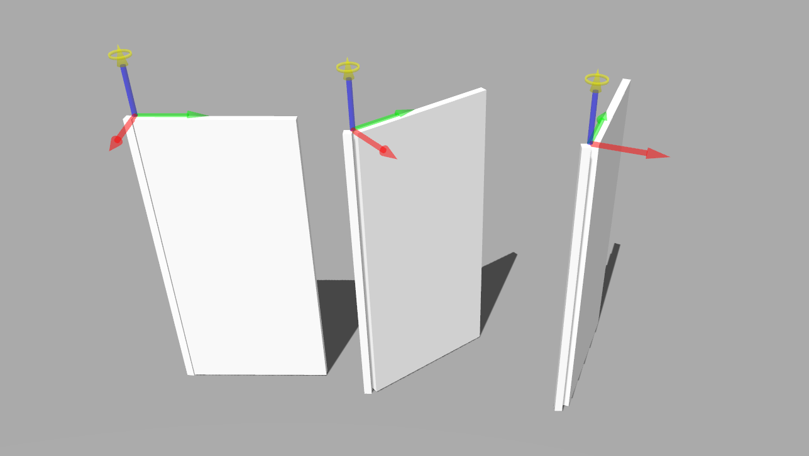
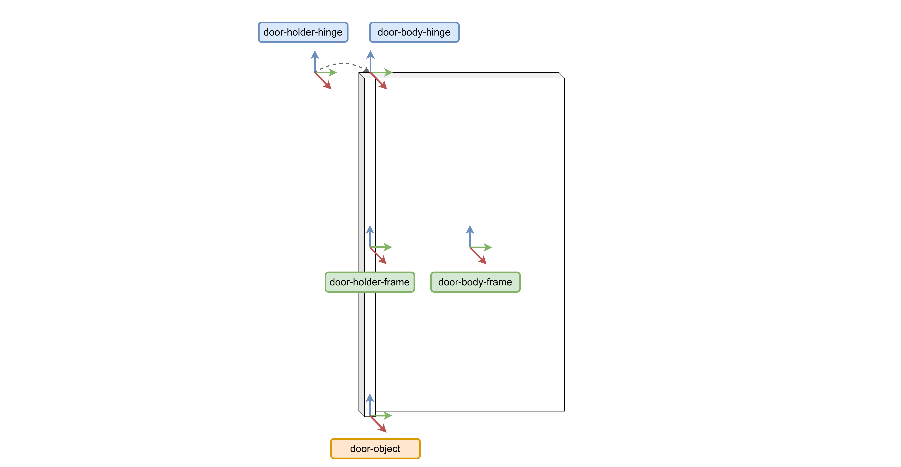
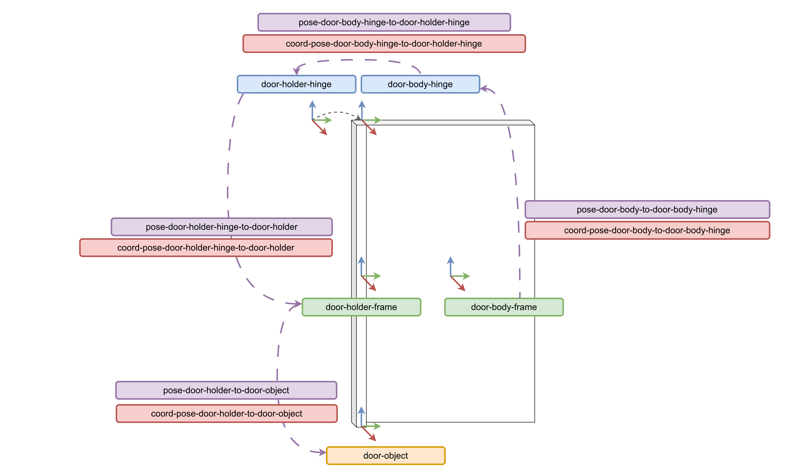
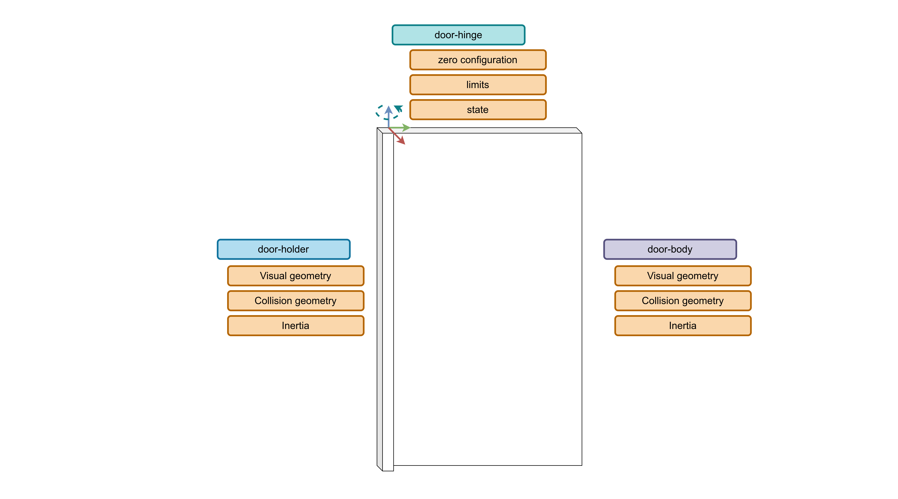

# Modelling a door

||
|:-----------------------:|
|Figure 1: a door model |

A door is an object with a motion constraint. It has a hinge that attaches the door to the doorway, and which constraints its movement to a swing action that allows for opening and closing. In this tutorial we will review the modelling process to create a door with our tool.

A door can be modelled as a kinematic chain, with two links representing the doorway and the door itself. A revolute joint represents the hinge, and it joins the two links and constrains the movement of the door with regards to the doorway. All the following model snippets, as well as the complete json-ld model of the door is available [here](../input/object-door.json).

The first elements to model are the geometric skeleton of the door. Those are points, vectors, and frames. For our door we need to model 5 frames: the `door-object` frame is the root of the object. This frame is later used to specify a pose in the world with an object instance. The door is made up of two links and a joint. Each link can have multiple frames associated with it. In this case, one at the centre of each link (`door-holder-frame` and `door-body-frame`), and two frames of coincident origins for the joint (`door-holder-hinge` and `door-body-hinge`). For these last two, we model the frame not only as an entity with an origin point, but also its three direction vectors. This allows specifying the axis of the joint where the motion is constrained to.

||
|:-----------------------:|
|Figure 2: all the frames required to model the door |

```json
{
    "@id": "point-joint-door-hinge-origin",
    "@type": [ "3D", "Euclidean", "Point" ]
},
{
    "@id": "vector-joint-door-hinge-joint-x",
    "@type": [ "3D", "Euclidean", "Vector", "BoundVector", "UnitLength" ],
    "start": "point-door-hinge-origin"
},

{
    "@id": "frame-joint-door-hinge",
    "@type": [
        "3D", 
        "Euclidean", 
        "Frame", 
        "Orthonormal", 
        "RigidBody", 
        "RightHanded", 
        "OriginVectorsXYZ"
        ],
    "origin": "point-joint-door-hinge-origin",
    "vector-x": "vector-joint-door-hinge-joint-x",
    "vector-y": "vector-joint-door-hinge-joint-y",
    "vector-z": "vector-joint-door-hinge-joint-z"
}
```

These elements are the building blocks for the spatial relations necessary to position the links and joints in space. The pose is specified for each frame with regards to another frame. This representation is coordinate free, as coordinates are associated with another entity that refers to the pose, as shown in this snippet: 

```json
{
    "@id": "pose-frame-joint-door-hinge-wrt-frame-door-holder-origin",
    "@type": "Pose",
    "of": "frame-joint-door-hinge",
    "with-respect-to": "frame-door-holder-origin",
    "quantity-kind": [ "Angle", "Length" ]
},
{
    "@id": "coord-pose-frame-joint-door-hinge-wrt-frame-door-holder-origin",
    "@type": [
        "PoseReference",
        "PoseCoordinate",
        "VectorXYZ"
    ],
    "unit": ["M", "RAD"],
    "of-pose": "pose-frame-joint-door-hinge-wrt-frame-door-holder-origin",
    "as-seen-by": "frame-door-holder-origin",
    "x": -0.025,
    "y": 0.025,
    "z": 0,
    "theta": 0
}
```
To model the pose of each link and joint, only 4 pose descriptions are necessary, and they are illustrated here:

||
|:----------------------------------:|
|Figure 3: all the pose relations and coordinate references required for the door model|

For each link in the kinematic chain there is also inertia, visual geometry, and collision geometry information that is required. The joint of the door also requires some information about the zero configuration, its maximum and lowest values, and optionally the states that it can be. 

||
|:-------------------------------------------:|
|Figure 4: models required for each link and joint in the kinematic chain|

For the link, we must model the rigid body inertia. This is straightforward as it only requires calculating the moment of inertia values, for which there are calculator tools available. In the simulator, in this case [Gazebo](https://gazebosim.org/), each link is represented visually and physically with a polytope. The polytope can be modelled in various ways. For our example we model the polytope using the `"GazeboCuboid"` type, which describes a cuboid by its length in the x, z, and y directions. We then link this cuboid model to the visual and physics representation of the door body using the `"LinkVisualRepresentation"` and `"LinkPhysicsRepresentation"`.

```json
{
    "@id": "inertia-door-body",
    "@type":  [ 
        "RigidBodyInertia", 
        "Mass", 
        "RotationalInertia", 
        "PrincipalMomentsOfInertiaXYZ" 
        ],
    "of-body": "door-body",
    "reference-point": "point-door-body-origin",
    "as-seen-by": "frame-door-body-hinge",
    "quantity-kind": [ "MomentOfInertia", "Mass" ],
    "unit": [ "KiloGM-M2", "KiloGM" ],
    "xx": 0.4069,
    "yy": 0.3322,
    "zz": 0.0751,
    "mass": 1.0
},
{
    "@id": "polytope-door-body",
    "@type": ["Polytope", "3DPolytope", "GazeboCuboid"],
    "unit": "M",
    "x-size": 0.05,
    "y-size": 0.93,
    "z-size": 1.98
},
{
    "@id": "link-visual-door-body",
    "@type": ["LinkWithPolytope", "LinkVisualRepresentation"],
    "link": "door-body",
    "polytope": "polytope-door-body"
},
{
    "@id": "link-physics-door-body",
    "@type": ["LinkWithPolytope", "LinkPhysicsRepresentation"],
    "link": "door-body",
    "polytope": "polytope-door-body"
}
```

The modelling of the joint and the rest of the kinematic chain is explained in more detail in [this tutorial](https://github.com/comp-rob2b/modelling-tutorial#kinematic-chain). 

