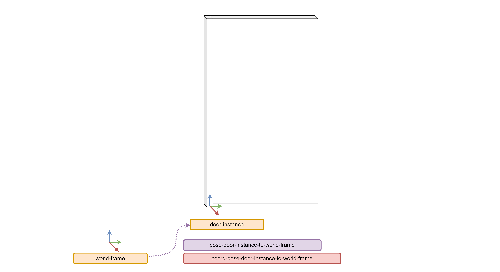

# Placing an object in the FloorPlan

||
|:--------------------------------------:|
|Figure 5: frames and pose modelled to place an object instance in the world |

Placing an object instance in the simulation world requires modelling a new frame of reference. We model a frame with its origin, where the frame is co-located with the object frame of the object instance. This way, by specifying a pose to this frame of reference we can give a pose to the object instance in the world. This relation between the frame of reference of the instance and the object frame of the object is implicit and is enforced by the script that interprets the models. For now we only need to model the frame of reference, and later refer to it when modelling the object instance. The instance placement model is available [here](../input/object-door-instance-1.json), and is the source for the following snippets.

```json
{
    "@id": "geom:point-location-door-1",
    "@type": "Point"
},
{
    "@id": "geom:frame-location-door-1",
    "@type": "Frame",
    "origin": "geom:point-location-door-1"
},
```

Since we are using the composable models, we can use any frame from the FloorPlan DSL model to specify the pose relation. For instance, the frame of id `frame-left_long_corridor-wall-1` comes from the floor plan model. We can obtain the composable models from the FloorPlan DSL by using the TextX generator: 

```sh
textx generate <model_path> --target json-ld
```

We can then model the pose relation using one of the frames of the floor plan model. 
Modelling a pose works in the same way as in modelling the object: we model a coordinate free pose, and then link to it to specify coordinates. 

```json
{
    "@id": "pose-frame-location-door-1",
    "@type": "Pose",
    "of": "frame-location-door-1",
    "with-respect-to": "frame-left_long_corridor-wall-1"
}
{
    "@id": "door:coord-pose-frame-location-door-1",
    "@type": [
        "PoseReference",
        "PoseCoordinate",
        "VectorXYZ"
    ],
    "of-pose": "door:pose-frame-location-door-1",
    "as-seen-by": "geom:frame-left_long_corridor-wall-1",
    "unit": [
        "M",
        "degrees"
    ],
    "theta": -90.0,
    "x": 20.50,
    "y": 0.1,
    "z": 0.0
},
```

In our `"ModelInstance"` entity we can link together the instance frame, the object to be instantiated, and in which world it is instantiated. Optionally, we can also specify an initial state for the objects. 

```json
{
    "@id": "door-instance-1",
    "@type": "ObjectInstance",
    "frame": "frame-location-door-1",
    "of-object": "door",
    "world": "brsu_building_c_with_doorways",
}
```

After running our tool, we obtain the SDF model file for the object, and a world file (also specified in SDF) for Gazebo. The input parameter for our tool is the folder that contains all the json-ld models. For this example, all the json-ld models are available [here](../input/).

```sh
python3 main.py <input folder> 
```

||
|:----------------------------------:|
| Figure 6: screenshot of Gazebo showing the doors positioned inside the entryways|
