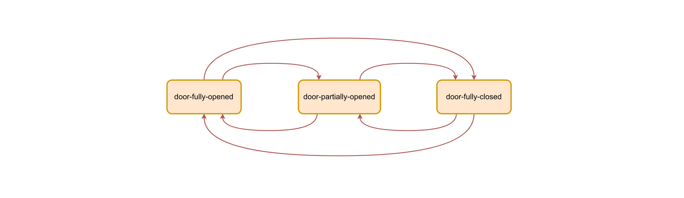
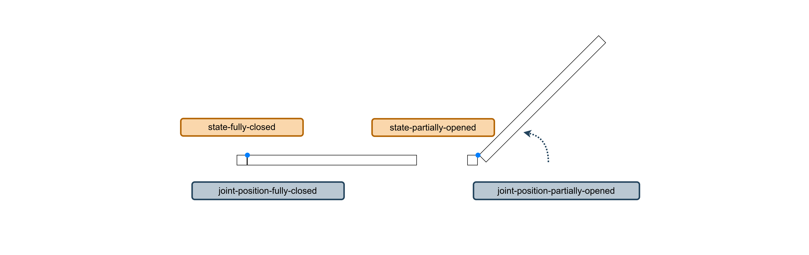

# Modelling Door States

<!-- a state machine and specify intial states -->

||
|:--------------------------------------------:|
| Figure 7: finite state machine for a door |

It might be of interest for a test that a door is at a specific state. A finite state machine, such as the one picture above, can be used to model all the states the door can be in and the transitions between them. With kinematic chains, such as the door, the states can refer to joint positions. A fully closed door is a door where the joint position is set to 0 radians, whereas a fully opened door has the joint position set at 1.7 radians. We compose the joints positions with the states model to specify the pose of the door at a specific state. The object state model is available [here](../input/object-door-states.json).

||
|:---------------------------------------------:|
| Figure 8: door states with their joint positions |

```json
{
    "@id": "door-fully-opened",
    "@type": "State"
},
{
    "@id": "joint-pose-door-fully-opened",
    "@type": [ 
        "JointReference", 
        "JointPosition", 
        "RevoluteJointPosition", 
        "RevoluteJointPositionCoordinate", 
        "JointLowerLimit" 
        ],
    "of-joint": "joint-door-hinge",
    "quantity-kind": "Angle",
    "unit": "RAD",
    "value": 1.6
},
{
    "@id": "joint-state-door-fully-opened",
    "@type": "JointState",
    "joint": "joint-door-hinge",
    "pose": "joint-pose-door-fully-opened",
    "state": "door-fully-opened"
},
```

With the state definitions, we can now add an initial state to the object instance. This will add a [Gazebo plugin](https://github.com/secorolab/floorplan-gazebo-plugins) to the SDF model so that the door is set up to the correct state at start-up. 

```json
{
    "@id": "door-instance-2",
    "@type": "ObjectInstance",
    
    "start-state": "door-fully-opened"
}
```